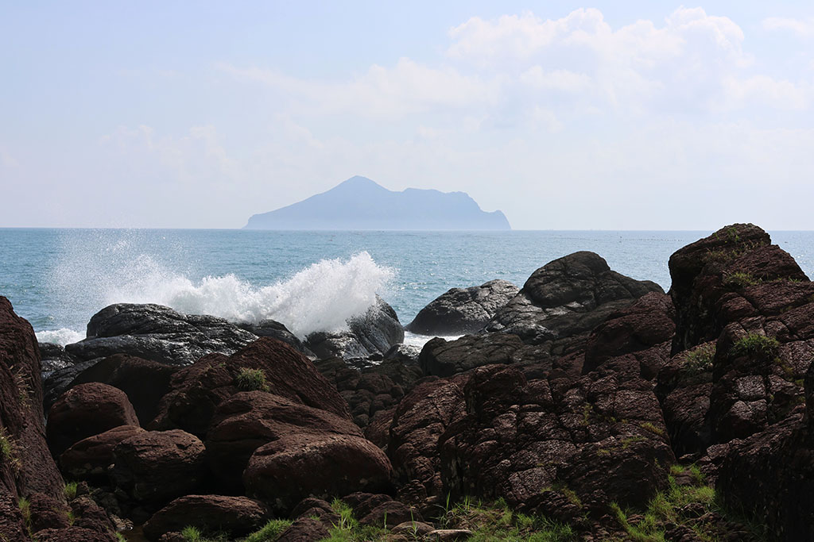

The sea and wind of Yilan always echo one another. The tides drive the daily rhythm of fishing village life, while the northeast monsoon carves rough and distinct lines in winter. The work uses delicate ripple changes and layers of low-saturation blue to depict the sea's multiple emotions—calm as a deep breath, surging like a roaring shout—presenting the rhythm of life in an Yilan ocean that is always moving, changing, and speaking.
