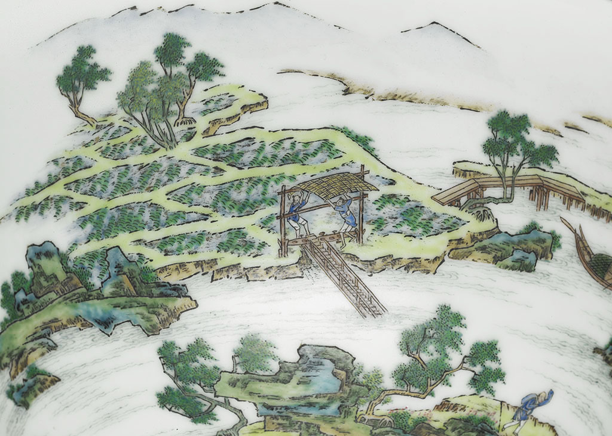

In this work, the two lines are not merely compositional borders but meridians connecting mountains and sea, condensing memories of life and culture. Through the cutting of meridian lines and the stacking and random appearance of visual elements, the scenery of Yilan—from sky and mountains to ocean and fields—is transformed into "flowing fragments." When reading the generated images, viewers feel like they are riding a train through the Lanyang Plain, with the scenery constantly changing. Everyone can link their own Lanyang narrative in this visual journey using their own experiences and emotions.
