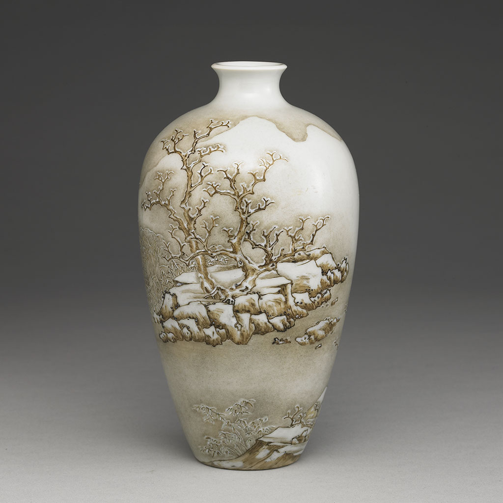

This piece selects the Meiping Vase as an element because the fishing boat and blooming plants on the vase evoke the scenery seen upon entering Yilan. Based on the stone houses of Shicheng Station—the first entrance to Lanyang—it features crape myrtle flowers, which once marked the boundaries of Jiuqiong City (Old Yilan City) and still bloom today. In the design, scattered and chic shale rocks appear, with mold on the stones falling like snow, entering the visual world of Yilan's scenery.
