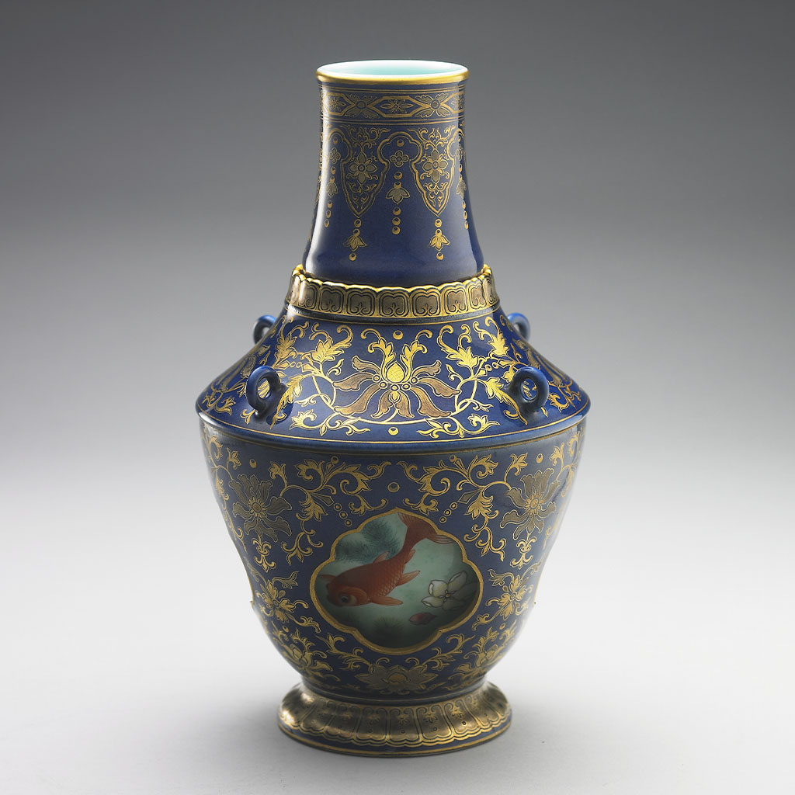

This piece uses the Revolving Vase to represent the flow of time in Lanyang, experiencing the region in a more abstract way. Consistent with the revolving vase concept, the inner layer features different shapes of Guishan Island, while the outer layer maintains a blue background with gold patterns. Rotating to different angles reveals Guishan Island at different times and in different forms, symbolizing that Guishan Island can be seen from various places in Yilan. Although the angle changes, the island is always in the background. Wrapped in materials of the ubiquitous Lanyang sky, sea, and floor tiles, one can glimpse many daily memories within: flowers outside the door, tunnels the train passes through, and the devout faith of the Mazu Temple...
