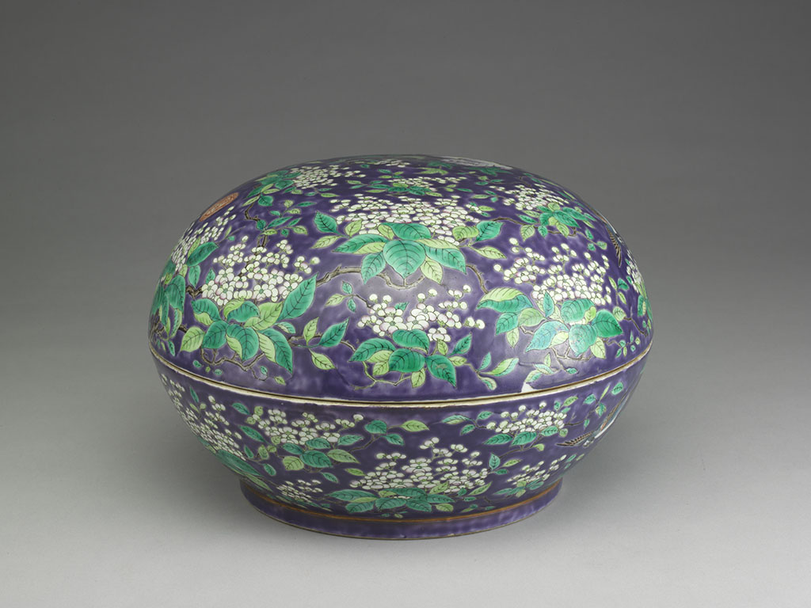

Drawn from the dynamic lines of waves in the "Eight Scenes of Lanyang," this presents the narrative of the majestic sea and changing tides from the Gazetteer of Kavalan Subprefecture. Blue-toned artifacts are scattered among the shimmering waves, symbolizing the rich resources brought by the ocean and the convergence of foreign cultures. The fluidity of the sea represents the water-like tolerance and resilience of Yilan people in the face of natural changes.
