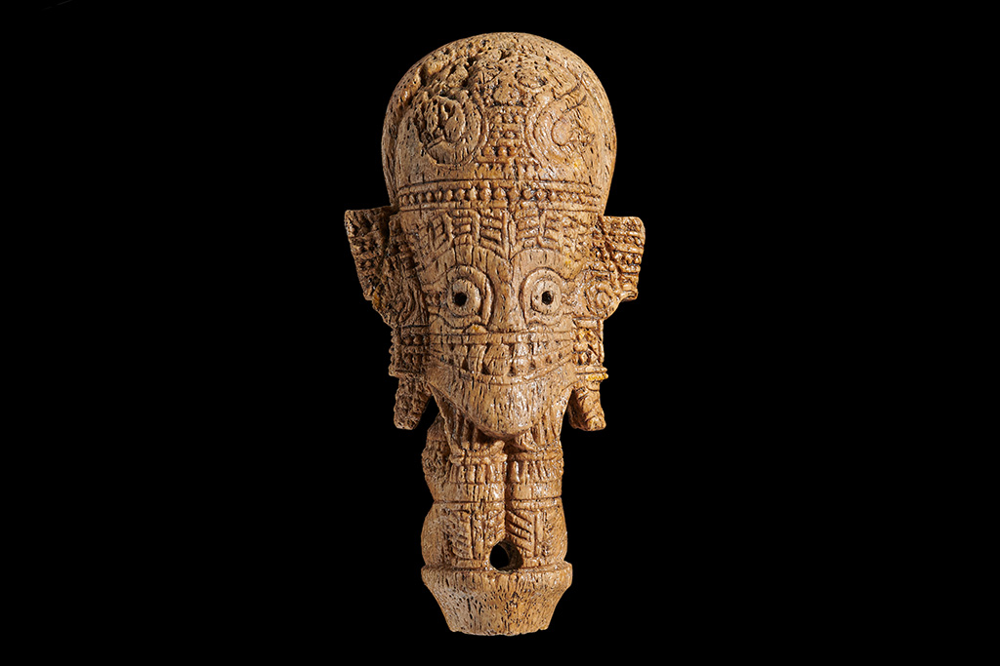

"People" are the core of this work and the writers behind the Gazetteer of Kavalan Subprefecture. The character for "person", composed of calligraphy strokes, is woven from yellow-toned artifacts, symbolizing the crystallization of wisdom and creativity. Only through human participation can the landscape of mountains and seas be endowed with meaning and passed down as history. Each generation of the character "person" represents a unique footprint left by an individual in the long river of culture.
