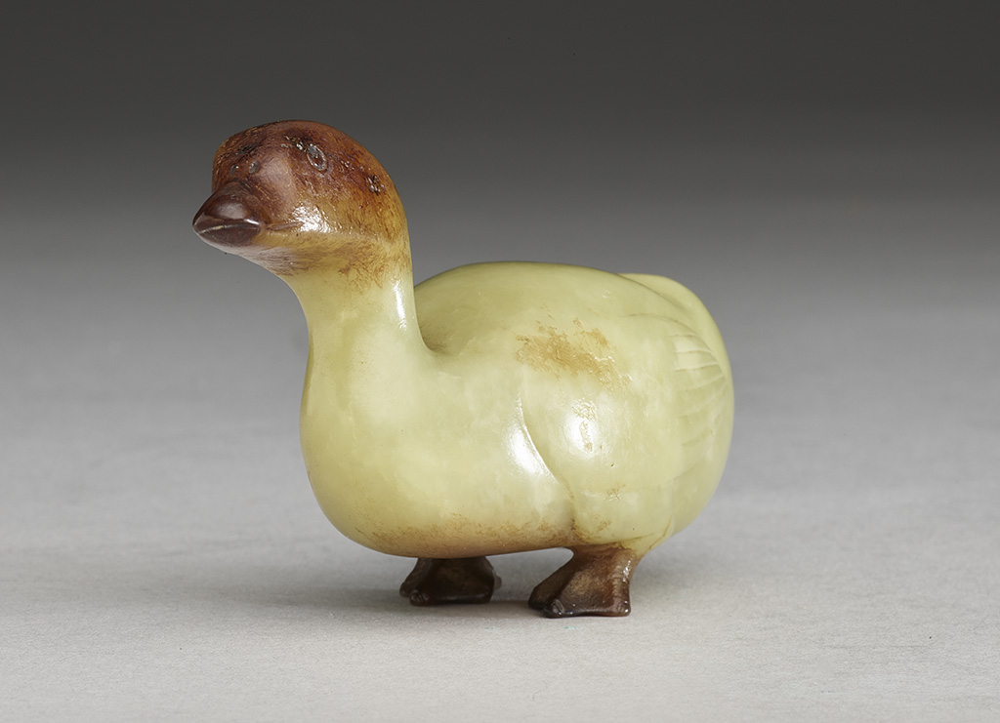

The Jade Duck symbolizes Yilan's famous product, smoked duck (Ya Shang), and represents the precious species living on this land. In the rotation of the kaleidoscope, the Jade Duck acts like scattered points of light, connecting Yilan's food culture and natural ecology. Ducks are a familiar daily scene for Yilan people; whether as flocks in rice fields or delicacies on the table, they carry the memories of this land. As an artifact, the Jade Duck combines traditional craftsmanship with contemporary imagery, presenting Yilan's rich and diverse cultural face under the refraction of multi-faceted mirrors.
