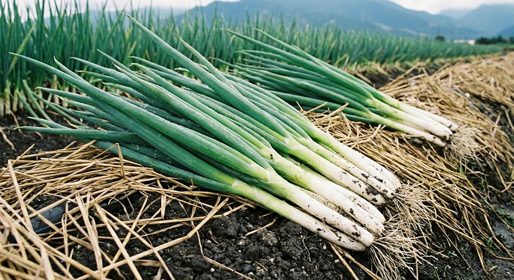

Sanxing scallions are the agricultural pride of Yilan. Their slender forms turn into flowing lines in the kaleidoscope. The greenery and regular arrangement of scallion fields symbolize the farmers' hard work and the land's generosity. In the rotating mirror images, the lines of scallions extend and intertwine like the texture of life in Yilan—both orderly and full of change. Scallions are not just ingredients but visual imprints of the Lanyang Plain, revealing the rhythmic beauty of the agricultural landscape through the kaleidoscope's reorganization.
