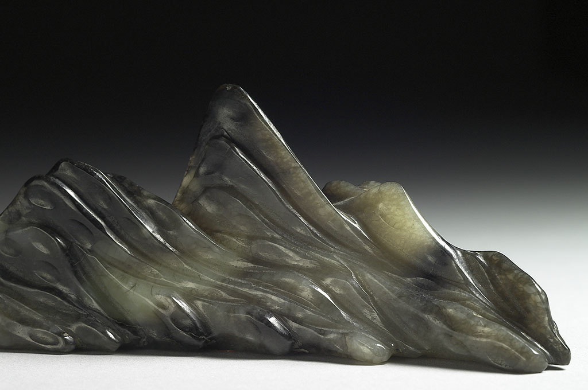

The Jade Brush Rest in the Shape of a Mountain Range represents Yilan's mountainous terrain, forming the stable structure of the kaleidoscope with its solid planes. The layering and undulation of mountains form symmetrical geometric patterns under the reflection of multi-faceted mirrors, appearing both abstract and concrete. Mountains are Yilan's barrier and foundation; the terrain surrounded by mountains on three sides shapes a unique landscape. As an artifact, the Jade Brush Rest in the Shape of a Mountain Range condenses the imagery of mountains into a tangible object. In the rotating kaleidoscope, the planes of the mountain constantly reorganize, presenting multiple perspectives and the eternal changes of Yilan's landscape.
