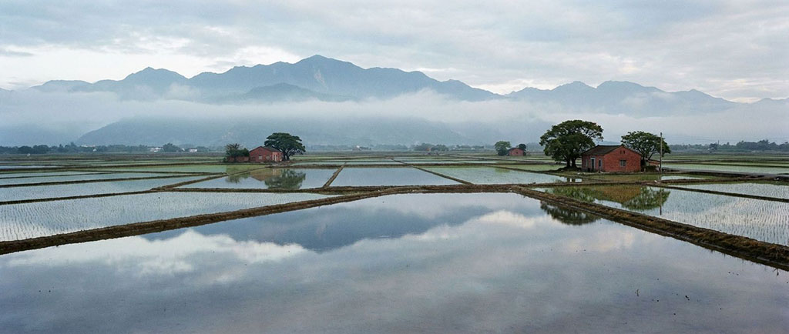

Looking out from a 1960s train window reveals a pure rural landscape. Vast rice fields stretch to distant mountains, with low houses scattered among them. In Yilan, a land of water, "Duck Mother Boats" can be seen everywhere shuttling through the paddies. In this era, Yilan maintained a primitive distance from nature; mountains and sea held their places, and agriculture was the only rhythm of life. Through the old wooden window frame, we see not just a landscape, but an era unaltered by rapid transport. The swaying train moves slowly, giving travelers enough time to gaze at every wave of rice and every mountain peak, feeling the most rustic warmth of life in Yilan.
