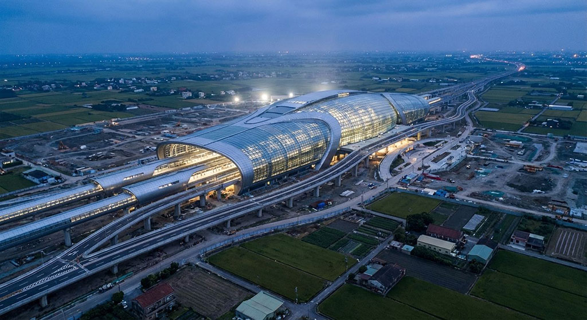

The hypothetical high-speed rail window view of 2036 presents a faster, more vertical Yilan. The arrival of high-speed rail compresses travel time once again, and the scenery outside flashes by at greater speeds. Urban architecture grows upward, high-rises replace past houses, and the relationship between people and land becomes more complex. However, distant mountains and coastlines remain in view, reminding us that Yilan's geographical foundation has not changed. This future window frame carries a sci-fi feel but also hidden worries: In rapid development, can Yilan's natural landscape and sense of life be preserved? Through this window, we contemplate the costs and choices of progress.
